# Advantest R4131D: conversion to color display
This repository contains the resources and description of how I succesfully converted a R4131D spectrum analyzer with a dead monochrome CRT to color salvaging a 6" Amstrad portable LCD TV.
The method used here is applicable to other pieces of equipment which use the same architecture for video generation (Raster + Composite video out) as well as to other types of LCD monitors.
A future modification will involve converting the video output from composite monochrome to color VGA.
## Advantest R4131D Brief Description
According to [user manual](manuals/pdf_mn_ER4131_OPERATING_MANUAL.pdf)
> The R4131 covers a band-width as wide as 10kHz to 3500 MHz and is controlled by a microcomputer. 
> This analyzer features easy confirmation of all measuring conditions, since 
> its frequency span is 4 GHz to 50 kHz, 
> resolution is 1 MHz to 1 kHz, 
> level data resolution by a marker is 0.05 dB, 
> tube surface dynamic range is 80dB, 
> and the setting conditions of its major functions are shown on its CRT display.

(typos have been corrected, grammar has been left to its original form).

According to documentation the "D" version sports
* 100kHz display frequency accuracy on frequencies ≤ 2.5 GHz (AFC block, malfunctioning on my unit 😭)
* POSI/NEG display
* Occupied Bandwidth measurement

The analyzer looks like the following picture (taken from the internet, I have the same but I did not think about taking a picture before removing the CRT)

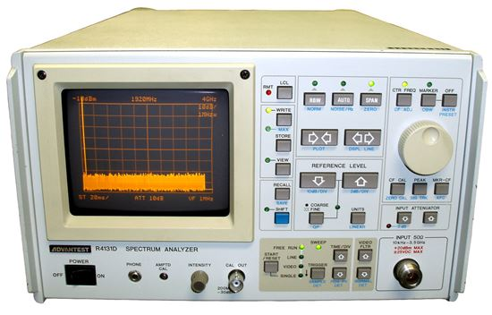

## How I Got the Analyzer and What Was Wrong
On March 2020 I was lucky enough to obtain from my friend **MrTimes** a R4131D with its tracking generator against the payment of a more than reasonable amount of 💰. The instruments came fully aligned, however the analyzer presented a "narrow display" issue (the trace was compressed vertically, sorry no picture again) and so an external CRT monitor connected to the analyzer rear video output came along.
I started using it in this configuration until July 2021 when all of a sudden the external monitor stopped functioning.
I was able to verify that the problem was due to the external CRT being dead using a VGA→HDMI converter + external HDMI monitor, but this solution was not practical so I decided it was time to fix the issue once for all.

## Troubleshooting
### Root Cause Analysis
The information we have are:
1. the video displayed on CRT is not correct
2. the video displayed on an external monitor using VIDEO OUT is correct

By looking at the block diagram on section 9-4 (page 203) of the [user manual](manuals/pdf_mn_ER4131_OPERATING_MANUAL.pdf), we can see that the CRT and composite video signals are both generated by the same module (CRT CNT):

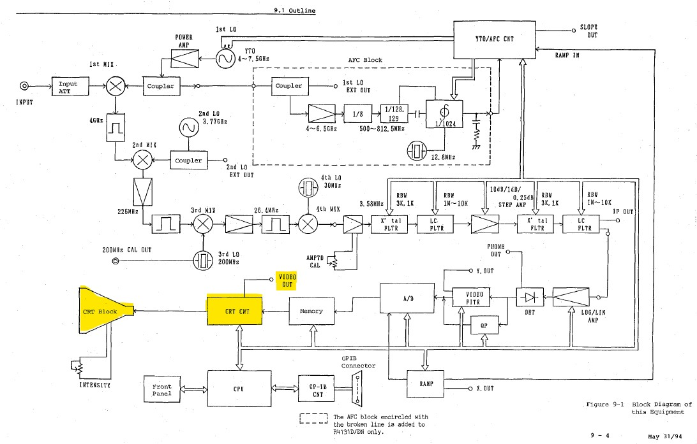

So it's safe to say that the problem is located on the CRT sub-assembly and not on the logic board. It'll be just a matter of locating the vertical amplifier schematic on the schematic and... no schematic at all for the CRT!

### Finding Another Solution
It was impossible to locate the schematic anywhere on the internet (hey if you have it, drop me a message!), so I started looking for information on the net. Who knows, maybe sobebody had my same problem and found the solution.
After a short google search with the right keywords I came over [this blog post](https://www.eevblog.com/forum/testgear/advantest-r4131d-lcd-display/) where **cizeta59** 
>\[...] Removed old R4131D tube display and replaced with6-inch color LCD screen taken from Amstrad T6 TV with video input \[...]

Bingo! I was able to exchange with him and he was so kind to give me his notes on the modification and the authorization to publish this guide.
The modification consists **in removing the old CRT assembly, building a diode multiplexer to generate R, G and B signals and then feed the signals to an old Amstrad T6 6" color LCD television** 

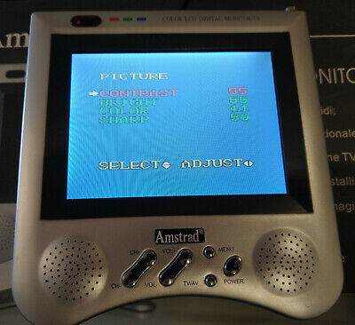

I was able to find an Amstrad T6 for a whopping 45€ and I jumped on it, however any other [LA76810](manuals/LA76810A.pdf)-based monitor would follow the same procedure.

### How the Video Signal is Constructed
On the Analyzer, the video displayed on the CRT is generated directly by the CPU in form of a [raster signal]'https://en.wikipedia.org/wiki/Raster_scan). On section "LOGIC BLR-015114" we have:
* Horizontal and Vertical Synchonization pulses ```*HSYNC``` and ```*VSYNC``` inverted by U13 and fed as ```HD``` and ```VD``` on pins 6 and 9 of J8
* The information (display signal, marker, scale, etc.) is fed to a 6 diodes multiplexer (D1 - D6, R5 - R10, R1 realizing a logic OR function) to an amplifier (Q1 - Q2) and becomes ```VIDEO``` signal, fed to the video input of CRT (J8 pin 8)

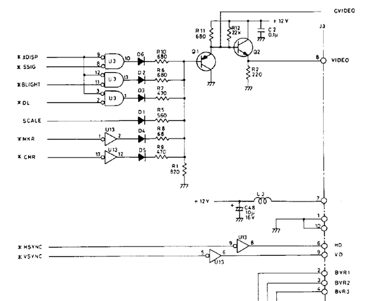

Basically ```*HSYNC``` gives the tempo for the orizontal swipe of the brush on each line while ```*VSYNC``` controls the jump from line to line. The ```VIDEO``` signal controls whether or not the brush draws a pixel. As everything is synchrinized by the same timebase, we get a meaningful image on the screen.

The ```VIDEO``` information is used to build a [composite video output](https://en.wikipedia.org/wiki/Composite_video) accessible from the rear panel trough a BNC:

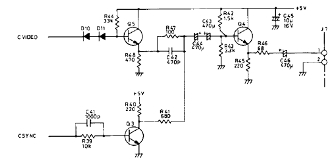

This amplifier combines ```OSYNC``` (created by U23 and producing horizontal and vertical sync pulses) with ```OVIDEO``` (luminance level) into an amplitude modulated signal fed through J7 to the rear panel.

For an in depth digression on how composite video works, check out this [tech tip from SENCORE](manuals/TT148-4053.pdf).

### Constructing the RGB video Signal and Feeding it to the LCD
Our new monitor will be fed by 5 different signals
* R, G and B video fed directly to LA76819 pins 14, 15 and 16
* Composite video for the LCD TV to recover H and V sinchronism
* +12V from the analyzer (former CRT power supply)

There are 5 different information which need to be assigned to color channels:

<table>
  <tr><th>Diode</th><th>Signal</th><th>Color</th></tr>
  <tr><td>D1</td><td>SCALE (Grid)</td><td>Red</td></tr>
  <tr><td>D2</td><td>TRACE</td><td>Green</td></tr>
  <tr><td>D3</td><td>?</td><td>Green</td></tr>
  <tr><td>D4</td><td>MARKER</td><td>Blue</td></tr>
  <tr><td>D5</td><td>TEXT</td><td>Blue</td></tr>
  <tr><td>D6</td><td>TRACE</td><td>Green</td></tr>
</table>

Please note that:
1. I was not able to identify what information the signal connected to D3 carries (NOR between ```*DISP``` and ```*OL```)
2. During testing I found that the TRACE signal is present on both D2 and D6 cathodes. This makes me think that the actual trace is carried by ```*DISP``` signal
3. I chose the simplest correspondence between information and color: Scale is red, trace and text is green, marker is blue. For more exotic colors you'll have to experiment with channel combination (most likely weighting with resistors), however the complexity of the circuit might grow beyond what is practical.

The following scheme shows how I wired a new diode matrix between the analyzer and TV to implement the table above:

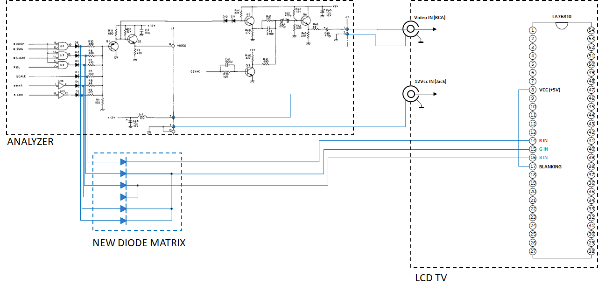

The diode matrix was assembled on a piece of breadboard: the board is connected directly to cathodes of D1-6 using wires. Diodes can be any general pourpose Si diodes, I used 1N4148. 
I decided to use connectors to place the diodes on the board so that it'll be easier to experiment in case I want to modify the color layout.

For the rest of the connections:
* I picked the Composite video signal on J7 (accessible on the side of the analyzer). If you want to keep the video signal accessible on the rear panel, you'll have to build a male-female jumper to avoid soldering directly on the board (and the risk associated with dispantling/reassembling the board stack)
* I powered the Amstrad TV from J3, connecting power and GND to limit the risk of noise (unused since there is no more CRT). Here's the pin assignment on J3:

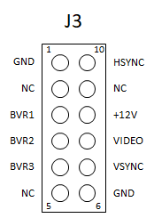

## Pictures
This is the first attempt to remove the CRT assembly, hoping there is no screw on the bottom...

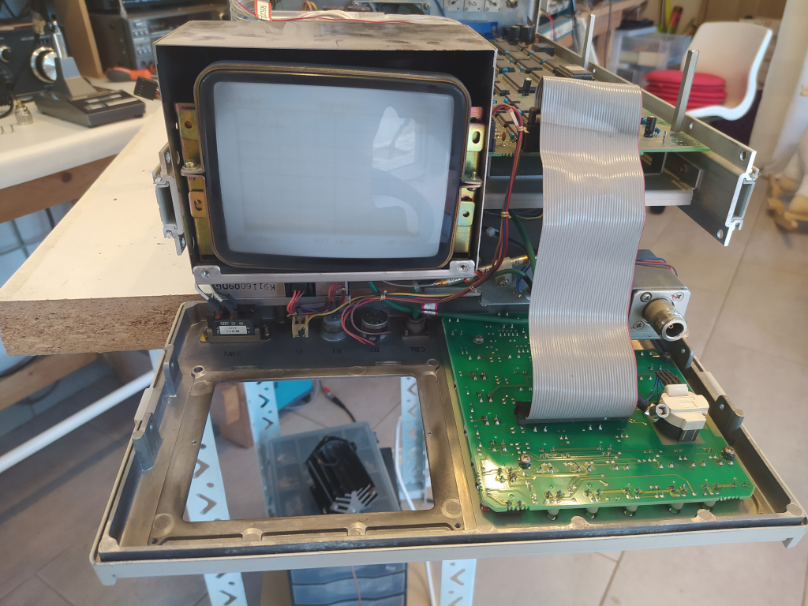

Epic Fail: I'll end up removing bottom RF Block and YTO in order to access the screws securing the CRT to the middle plate

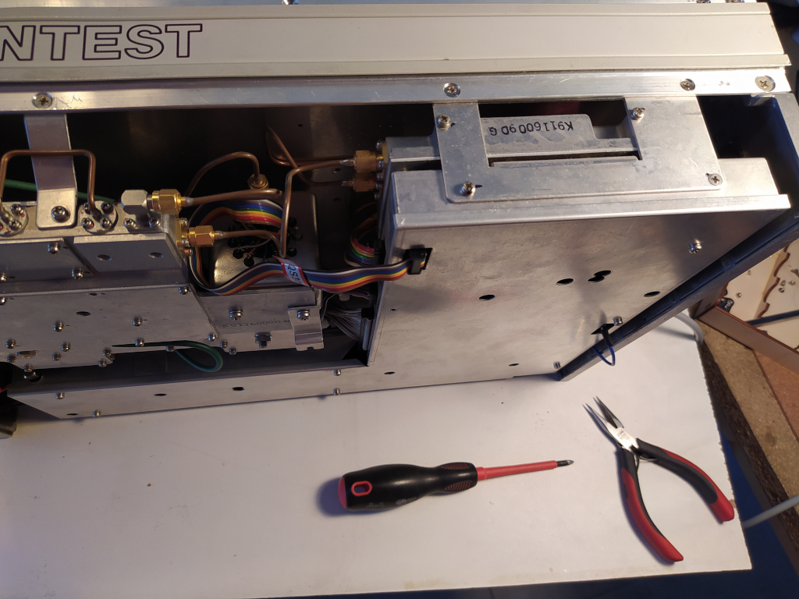

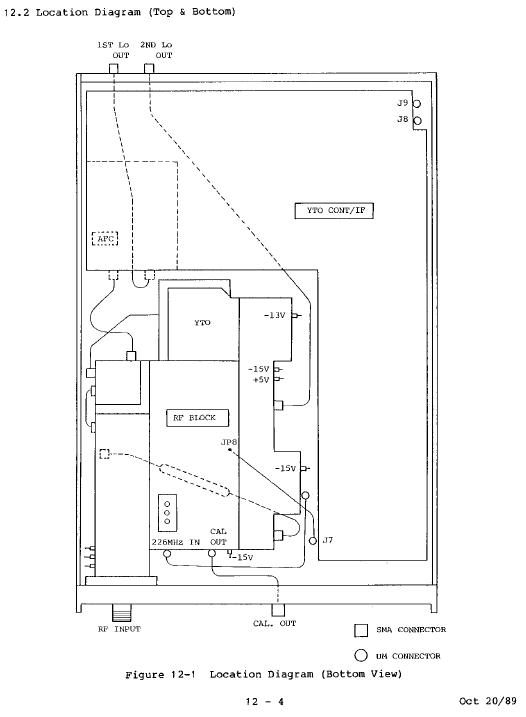

Side view of the LCD board not yet secured. You can see the wires connecting the new diode matrix to Logic Board and to LCD PCB:

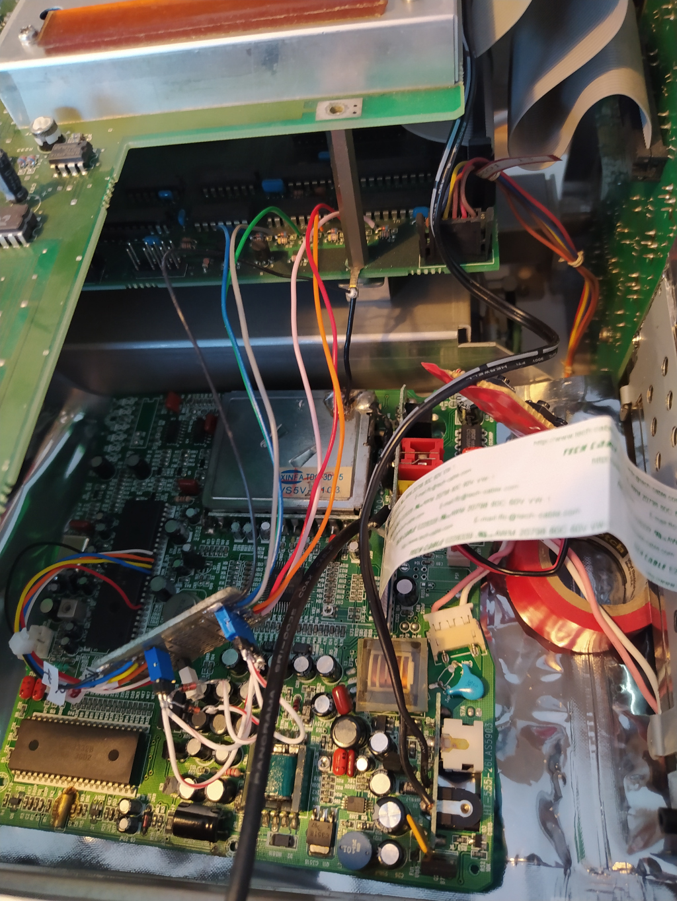

Please note the ground connection between the LCD board and the chassis of the instrument. The diode matrix board was not yet mechanically secured.

Another view of the board now secured to the chassis:

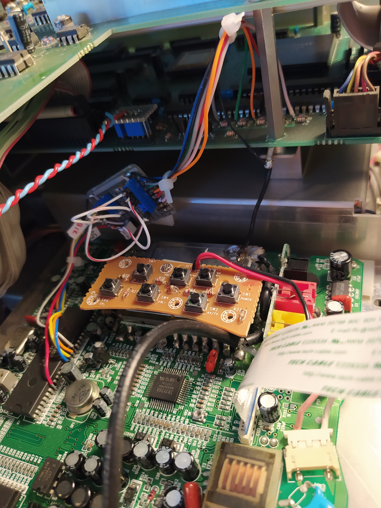

I used adhesive PCB supports to secure everything and ensure there are no shorts:


The LCD TV control button have been secured using a support so that settings are accessible opening the upper cover of the analyzer.

This is the result on the screen:

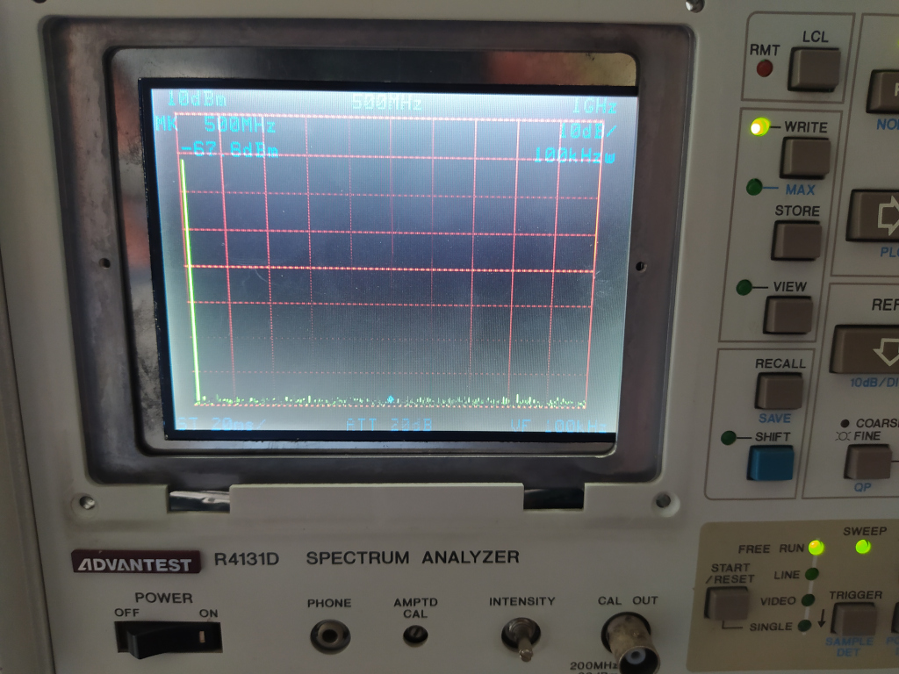

The LCD was not yet secured to the front panel. For that I had to build metal brackets and used the screws of the front screen bezel as supports.

The LCD will power up automatically when powering up the instrument. Please note that due to the LCD boot time, the analyzer diagnostic information (showed on the screen at boot) will not be visible.
The "INTENSITY" potentiometer will become uneffective. A future improvement will be to control LCD backlight using this potentiometer.

## TO DO LIST
- [ ] Convert rear panel composite video out to VGA
- [ ] Control LCD backlight using INTENSITY potentiometer


